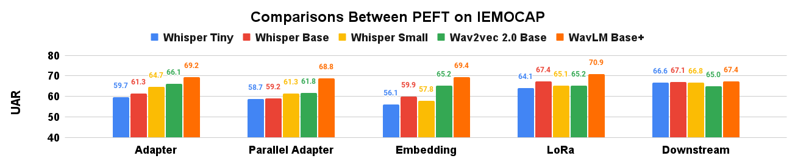

# PEFT-SER [[Paper Link](https://arxiv.org/abs/2306.05350)] was accepted to 11th International Conference on Affective Computing and Intelligent Interaction (ACII), 2023. 

#### This work include implementations for PEFT-SER: On the Use of Parameter Efficient Transfer Learning Approaches For Speech Emotion Recognition Using Pre-trained Speech Models. PEFT-SER is an open source project for researchers exploring SER applications with using parameter efficient finetuning methods.


#### Our framework support popular pre-trained speech models:

1. Wav2vec 2.0
2. WavLM Base+
3. Whisper Tiny
4. Whisper Base
5. Whisper Small
6. MMS, WavLM Large, HuBert, Whisper Medium (adding soon)


### Ready-to-use PEFT-SER models
### 1. Installation
```
pip install peft-ser
```

### 2. Model Loading
```
# whisper style loading
import peft_ser
model = peft_ser.load_model("whisper-base-lora-16-conv")

data = torch.zeros([1, 16000])
output = model(data)
```
#### a. Output mapping
The output emotion mappings are: **{0: "Neutral", 1: "Angry", 2: "Sad", 3: "Happy"}**. We would add a version for 6-emotion later.

#### b. Available models

Pre-trained Model | Test Performance without PEFT | Test Performance with LoRa | PEFT Model Name
|---|---|---|---
Whisper Tiny | 62.26 | 63.48 | whisper-tiny-lora-16-conv 
Whisper Base | 64.39 | 64.92 | whisper-base-lora-16-conv 
Whisper Small | 65.77 | 66.01 | whisper-small-lora-16-conv  
WavLM Base+ | 63.06 | 66.11 | wavlm-plus-lora-16-conv 
WavLM Large | 68.32 | **68.66** | wavlm-large-lora-16-conv 

### Paper repo
### 1. Installation
To begin with, please clone this repo:
```
git clone git@github.com:usc-sail/peft-ser.git
```

To install the conda environment:
```
cd peft-ser
conda env create -f peft-ser.yml
conda activate peft-ser
```

Please specify the data file to your work dir under config/config.yml

```
data_dir:
  crema_d: CREMA_D_PATH
  iemocap: IEMOCAP_PATH
  msp-improv: MSP-IMPROV_PATH
  msp-podcast: MSP-PODCAST_PATH
project_dir: OUTPUT_PATH
```


### 2. Data Spliting
For most of the dataset, user need first split the train/dev/test by the given script file. Take the IEMOCAP data as instance:
```
cd train_split_gen
python3 iemocap.py
```

### 3. Audio Preprocess
For most of the dataset, user can generate the preprocessed audio file by the given script file. The preprocessing includes resample to 16kHz and to mono channel. Take the IEMOCAP data as instance:
```
cd preprocess_audio
python3 preprocess_audio.py --dataset iemocap
# dataset: iemocap, msp-improv, msp-podcast, crema_d
```
The script will generate the folder under your working dir:
```
OUTPUT_PATH/audio/iemocap
```

### 4. ML training
### 4.1 Finetune-downstream Model
To finetune the downstream model with a pretrained backbone, use the following:
```
cd experiment

CUDA_VISIBLE_DEVICES=0, taskset -c 1-60 python3 finetune_emotion.py --pretrain_model wavlm_plus --dataset crema_d --learning_rate 0.0005 --num_epochs 30 --finetune_method finetune
```

### 4.2 Adapter Finetune
To use adapter to train the downstream model with a pretrained backbone, use the following:
```
cd experiment

CUDA_VISIBLE_DEVICES=0, taskset -c 1-60 python3 finetune_emotion.py --pretrain_model wavlm_plus --dataset crema_d --learning_rate 0.0005 --num_epochs 30 --finetune_method adapter --adapter_hidden_dim 128
```

### 4.3 Embedding Prompt Finetune
To use embedding prompt to train the downstream model with a pretrained backbone, use the following:
```
cd experiment

CUDA_VISIBLE_DEVICES=0, taskset -c 1-60 python3 finetune_emotion.py --pretrain_model wavlm_plus --dataset crema_d --learning_rate 0.0005 --num_epochs 30 --finetune_method embedding_prompt --embedding_prompt_dim 5
```

### 4.4 LoRa Finetune
To use LoRa to train the downstream model with a pretrained backbone, use the following:
```
cd experiment

CUDA_VISIBLE_DEVICES=0, taskset -c 1-60 python3 finetune_emotion.py --pretrain_model wavlm_plus --dataset crema_d --learning_rate 0.0005 --num_epochs 30 --finetune_method lora --lora_rank 16
```

The output will be under: OUTPUT_PATH/result/, the output metrics is UAR, and the higher the metric, the better the performance.


#### Our framework demonstrates that LoRa is an effective way to finetune pre-trained speech models for SER (see example on IEMOCAP):

<div align="center">
 
</div>


#### Note: We are actively update and clean code before the conference date, if you use our code, please check the final version before ACII conference.